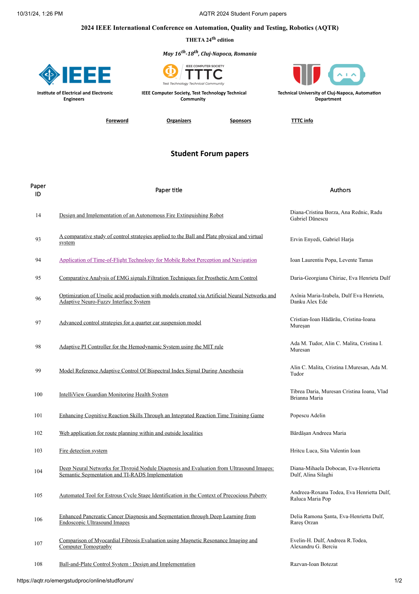
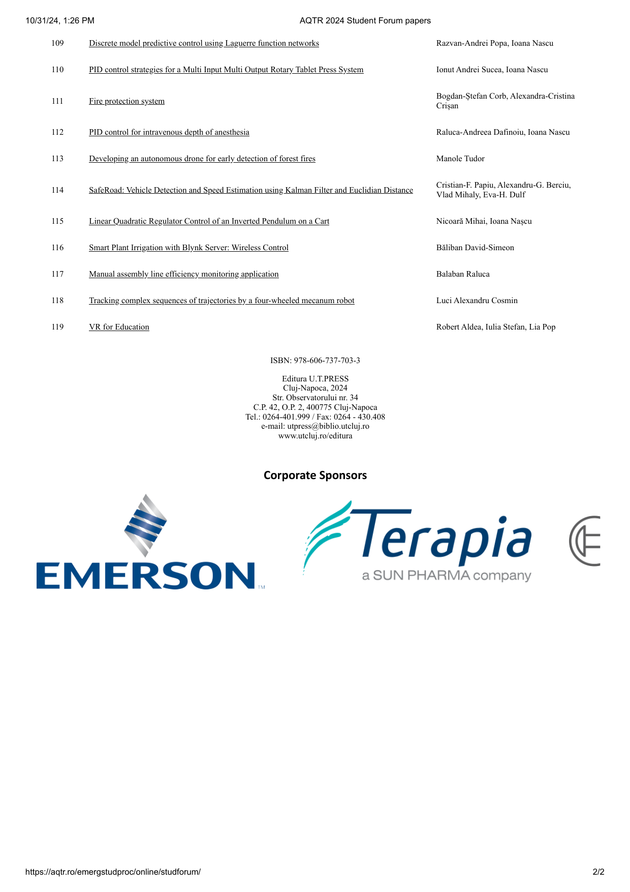

# Application of Time-of-Flight Technology for Mobile Robot Perception and Navigation

**AQTR 2024 Student Forum Paper**

## Project Page

**[https://laurent-19.github.io/AQTR2024-App-ToF-AMR/](https://laurent-19.github.io/AQTR2024-App-ToF-AMR/)**

## Authors

- Ioan Laurentiu Popa (Technical University of Cluj-Napoca)
- Levente Tamas (Technical University of Cluj-Napoca)

## Abstract

This paper presents a comprehensive exploration of mobile robot control and navigation, specifically within the domain of Wheel Mobile Robots, with a primary focus on the integration of Time of Flight technology. Leveraging Analog Devices' AD-96TOF1-EBZ kit for depth perception, the study investigates robotic mechanics, analyzes cognition structures, and implements localization, mapping, and navigation strategies.

## Key Contributions

- **ROS Support for Sphero RVR**: Development of Robot Operating System support for the newly released Sphero Rover, providing crucial odometry data
- **ToF Integration**: Time of Flight technology employed for real-time embedded applications
- **AMCL Localization**: 2D depth perception, mapping, and localization through Monte Carlo Localization algorithm
- **Navigation Performance**: Drift errors of approximately 2% of hall width, demonstrating excellent position control

## AQTR 2024 Student Forum

This paper was presented at the IEEE International Conference on Automation, Quality and Testing, Robotics (AQTR 2024), THETA 24th edition, May 16th-18th, Cluj-Napoca, Romania.

### Student Forum Webpage (Archived)

The original student forum webpage is no longer available. Below are archived screenshots:





## Hardware Components

- **Sphero RVR**: Four-wheel differential-driven mobile robot with IMU, accelerometer, gyroscope, and encoders
- **NVIDIA Jetson Nano**: Processing unit for cognition functions
- **ADI ToF Module AD-FXTOF1-EBZ**: Time-of-Flight depth camera for perception

## Related Resources

- [Sphero SDK (Python)](https://github.com/sphero-inc/sphero-sdk-raspberrypi-python) - Sphero RVR software development kit
- [ADI ToF SDK](https://github.com/analogdevicesinc/aditof_sdk) - Analog Devices Time-of-Flight SDK
- [ADI ToF Jetson Guide](https://wiki.analog.com/resources/eval/user-guides/ad-96tof1-ebz/ug_jetson) - Setup documentation

## Citation

```bibtex
@InProceedings{popa2024tofamr,
  author    = {Popa, Ioan Laurentiu and Tamas, Levente},
  booktitle = {2024 IEEE International Conference on Automation, Quality and Testing, Robotics (AQTR)},
  title     = {{Application of Time-of-Flight Technology for Mobile Robot Perception and Navigation}},
  year      = {2024},
  month     = {May},
  address   = {Cluj-Napoca, Romania},
  note      = {Student Forum Paper ID: 94},
}
```

## Conference Information

- **Conference**: AQTR 2024 - IEEE International Conference on Automation, Quality and Testing, Robotics
- **Edition**: THETA 24th
- **Date**: May 16th-18th, 2024
- **Location**: Cluj-Napoca, Romania
- **ISBN**: 978-606-737-703-3
- **Publisher**: Editura U.T.PRESS
